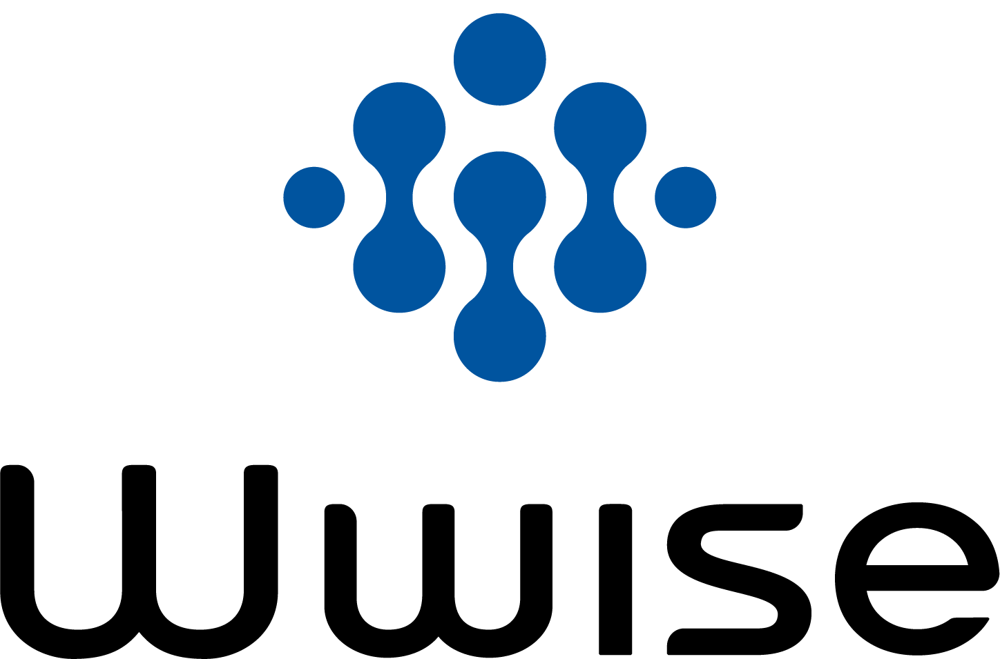
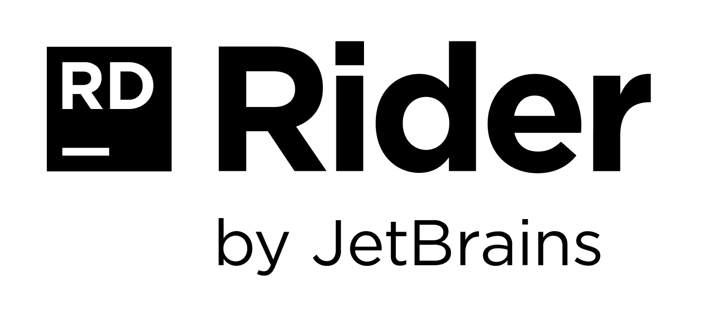
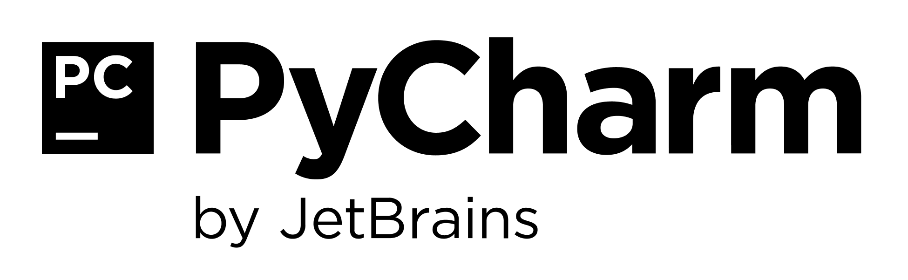
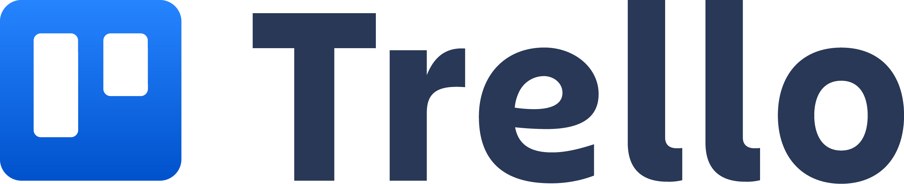

## andmedpin's Github 🌌

### Hello! 👋🏼
My name is Andres, I’m a Technical Sound Designer with a special interest and passion for audio, games, scripting, interactive media, and art.   

- 🔭 I’m currently working as a full time **Technical Sound Designer** contractor for **A Shell in the Pit** and as a **Game Audio Mentor** at **Vancouver Film School**
- 🌱 I graduated from the **Technical Arts Advanced Diploma** at **BCIT** and I'm currently studying a **M.SC. in Computer Science** at **IU** 
- 💬 Ask me about Indie Games, Mechanical Keyboards, Studio Ghibli Films, Food, and Travel 
- 😄 Pronouns: He/Him

#### Other Links
- [Twitter](https://twitter.com/andmedpin)   
- [LinkedIn](https://www.linkedin.com/in/andmedpin/)   

---

### Skills and Tools 🛰

- **🌉 Technical Sound Design:** &nbsp; Unreal Engine &nbsp;|&nbsp; Unity &nbsp;|&nbsp; Wwise &nbsp;|&nbsp; FMOD
- **🏙 Game Dev:** &nbsp; Git &nbsp;|&nbsp; Perforce &nbsp;|&nbsp; Rider &nbsp;|&nbsp; PyCharm &nbsp;|&nbsp; Jira
- **🗾 Aditional Skills:** &nbsp; Scripting with Python, C#, and C++ &nbsp;|&nbsp; Basic Modeling and Scripting in Autodesk Maya

<!--
#### Technologies:

   &nbsp;&nbsp;&nbsp;&nbsp;&nbsp;&nbsp;&nbsp;&nbsp;&nbsp;
   &nbsp;&nbsp;&nbsp;&nbsp;&nbsp;&nbsp;&nbsp;&nbsp;&nbsp;
   &nbsp;&nbsp;&nbsp;&nbsp;
  
   
   
   &nbsp;&nbsp;&nbsp;&nbsp;&nbsp;&nbsp;&nbsp;&nbsp;
   &nbsp;&nbsp;&nbsp;&nbsp;&nbsp;&nbsp;&nbsp;
   &nbsp;&nbsp;&nbsp;&nbsp;&nbsp;&nbsp;&nbsp;&nbsp;
   
   
   &nbsp;&nbsp;&nbsp;&nbsp;&nbsp;&nbsp;&nbsp;&nbsp;
  

**andmedpin/andmedpin** is a ✨ _special_ ✨ repository because its `README.md` (this file) appears on your GitHub profile.

Here are some ideas to get you started:

- 🔭 I’m currently working on ...
- 🌱 I’m currently learning ...
- 👯 I’m looking to collaborate on ...
- 🤔 I’m looking for help with ...
- 💬 Ask me about ...
- 📫 How to reach me: ...
- 😄 Pronouns: ...
- ⚡ Fun fact: ...
-->
